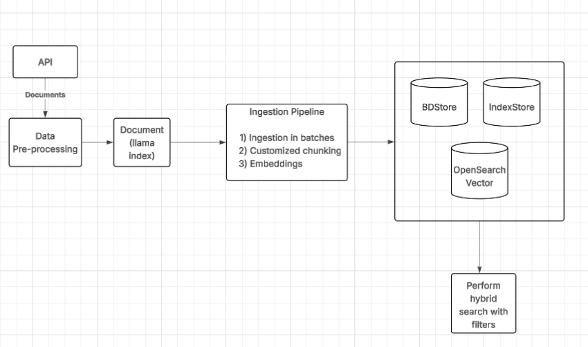

General LLM functionality for real scale projects.

1. First install postgress using brew: 
2. `brew install postgresql`
3. next `brew install make`
4. Then clone pgvector. Run the following in the terminal: 
   
* `/tmp % git clone --branch v0.8.0 https://github.com/pgvector/pgvector.git`
*  `cd pgvector`
*  `make install`

Then let's create a postgres DB with PGVector extension. In the terminal run:

* `brew services start postgresql`

* `createdb vectortutorial` . vectortutorial is the name of our db.
*  Then in the terminal run: `/opt/homebrew/bin/createuser -s postgres` or `/usr/local/opt/postgresql\@14/bin/createuser -s postgres`
* And finally: `psql --host localhost --username postgres --dbname vectortutorial`

To enable my DB to support vectors I run the following inside the db terminal:

* `CREATE EXTENSION IF NOT EXISTS vector;`

Now I can create a TAble with items that can store vectors: 

* OpenSearch Vector Store

To set up a local OpenSearch Instance follow the doc here: [https://opensearch.org/docs/1.0/](doc)

If you run into SSL Issues try the following docker run command instead:

`docker run -p 9200:9200 -p 9600:9600 -e "discovery.type=single-node" -e "plugins.security.disabled=true" opensearchproject/opensearch:1.0.1
`

## Node Parsers

They are simple abstractions that take a list of documents, and chunk them
into Node objects, such that each node is a specific chunk of the parent document. 
When a document is broken into nodes, all of it's attributes are inherited 
to the children nodes (i.e. metadata, text and metadata templates, etc)

Different Node Parsers:

1) MarkdownNodeParser: It splits a document into Nodes using Markdown header-based splitting logic. Each node contains its text content and the paths
of the headers leading to it.

